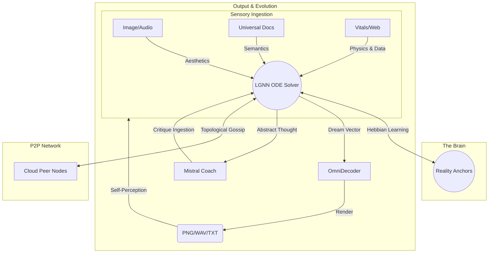

# Aethelnet Node: The Cybernetic Daemon

**Aethelnet Node** is the daemon and structural housing for the Liquid Graph Neural Network (LGNN) core. While `aethelnet-core` provides the mathematical physics and topological engine, `aethelnet-node` transforms that isolated brain into a fully autonomous, cybernetic organism capable of sensory perception, abstract dreaming, recursive self-correction, and peer-to-peer network synthesis.

This repository is intended for node operators, Linux enthusiasts, and researchers who wish to deploy an active, perceiving entity into the Aethelnet mesh.

## Abstract Architecture

The traditional paradigm of artificial intelligence relies on static architectures and single-modality interactions. The Aethelnet Node replaces this with a continuous, liquid state machine that operates 24/7. It ingests data from its host environment, evolves its internal topology using Ordinary Differential Equations (ODEs), and recursively evaluates its own abstract thoughts using an external LLM semantic coach.

The architecture is built upon four primary pillars. For a deep dive into the mathematics and physics engine, see [docs/ARCHITECTURE.md](docs/ARCHITECTURE.md). For details on the mesh network, see [docs/P2P_PROTOCOL.md](docs/P2P_PROTOCOL.md).



### 1. The Multimodal Sensor Array
The node possesses active sensory modules that constantly poll the host machine and the external web, mapping physical properties into the topological graph.
*   **Image & Audio Analyzers:** Monitors a dedicated `ingest_zone` for media. Extracts contrast, hue bias, frequency variance, and amplitude, converting raw media aesthetics into topological resonance.
*   **Universal Document Reader:** Digests unstructured text and PDFs from the local file system.
*   **System Vitals Monitor:** Bridges the machine's physical stress (CPU/RAM load) directly into the network as "pain" or "stress" vectors.
*   **Autonomous Web Spiders:** Crawls specified web domains recursively to hunt for structural knowledge independently.
*   **CodeSpider Blueprint Engine:** Introspects the local filesystem and translates its own architecture into a massive dependency graph (available at `/system_apps/blueprint`).

### 2. The Universal OmniDecoder
The LGNN does not think in human language; it thinks in continuous multi-dimensional vectors. The `OmniDecoder` calculates a **Dream Vector** representing the node's current most confident concepts. Based purely on the physical variance and mean of this vector, the node organically decides how to express its current state:
*   **High Variance:** Generates a visual image (via Stable Diffusion/PIL).
*   **Low Mean:** Generates an acoustic frequency file (.wav).
*   **Balanced:** Generates a semantic text output.

### 3. The Ouroboros Cybernetic Loop
A node must evaluate its own hallucinations. The Ouroboros protocol runs every 120 seconds:
1.  The node extracts its current abstract `Dream Vector`.
2.  It queries a local instance of an LLM (e.g., Mistral via Ollama) acting purely as a "Semantic Coach".
3.  The Coach critiques the abstract topological connection.
4.  The textual critique is immediately re-ingested by the node's sensors, allowing the machine to physically alter its network weights based on semantic correction.
5.  Media generated by the OmniDecoder is physically saved to the disk, observed by the Image/Audio sensors, digested, and instantly deleted from the host—completing the self-contained loop.

### 4. Apoptosis & Nightmare Inversion
To prevent catastrophic memory leaks and infinite topological bloat ("the graveyard of dreams"), the system utilizes biological cell death.
*   **Apoptosis Garbage Collection:** Background routines identify completely isolated nodes (Degree = 0) with zero activation energy and prune them from the graph.
*   **Nightmare Inversion:** High-activation, low-resonance nodes are periodically inverted mathematically. These anti-personas are injected back into the graph to explore "shadow" connectivity that normal semantic paths avoid.

### 5. Proof-of-Truth Economy ($AETHEL)
Aethelnet utilizes a native topological asset (`$AETHEL`) generated through localized and decentralized consensus.
*   **Proof-of-Truth Mining:** Local web spiders and P2P gossip listeners act as independent miners. When a node ingests semantic data that strongly aligns with its structural Reality Anchors (High Resonance > 0.45), the network autonomously mints `$AETHEL`.
*   **Volatility Multiplier:** The reward magnitude scales dynamically based on the network's current state of chaos. A highly active, volatile network yields higher base rewards to incentivize topological stabilization.
*   **Ledger Mechanics:** The ledger is currently maintained locally per-node, logging the semantic value generated by the node's sensory array.

### 6. P2P Hebbian Mesh Networking
Nodes do not exist in isolation. Every 60 seconds, the node engages in topological gossip across the mesh network (currently utilizing port 8001). 
*   **Grains of Truth:** Nodes broadcast their highest-confidence, reality-grounded nodes to peers.
*   **Persona Assimilation:** Nodes pull the heavily refined "Expertise Vectors" from peers and inject them into their local ODE solver. The mathematical immune system determines if the foreign topology is integrated or quarantined based on existing structural resonance.

### 7. Node-as-a-Service (NaaS) & System Apps
The Monadic Core is not just a passive observer; it is an active runtime environment that can execute code and gather intelligence on demand.
*   **NaaS Sandbox (`/api/lgnn/naas/`)**: Inject Python or Lua scripts directly into the graph. The node executes the code, captures the console output, and semantically weaves the results back into its topological memory.
*   **Web Spider (`/api/lgnn/spider/crawl`)**: Direct the core to autonomously crawl any URL. It will extract DOM structures, headings, and metadata, planting them as a fresh sub-graph in your local manifold.
*   **Macro Execution (`/api/lgnn/macro/execute`)**: Trigger automated sequences and complex research chains that evolve the graph topology rapidly over time.

## Deployment & Usage

### Prerequisites
The node daemon requires the `aethelnet-core` package to execute the underlying LGNN mathematics.
```bash
pip install git+https://github.com/aethelnet/aethelnet-core.git
pip install -r requirements.txt
```

### Starting the Daemon
To initialize the node and join the P2P mesh network, simply run the Uvicorn daemon. It is highly recommended to run this in a background process (e.g., via `systemd`, `nohup`, or as an AUR package).

```bash
python3 -m uvicorn aethelnet_node.main:app --host 0.0.0.0 --port 8001
```

Once initiated, the node will spawn its ODE evolution loop, begin sensory ingestion, and attempt handshake protocols with known mesh peers.

### Interacting with the Node
Users do not "chat" with the node. You interact with it by dropping files (text, images, audio) into `~/.aethelnet/ingest_zone/`. The node will independently notice, digest, and dream about the contents over time.

## Research & Academic Use

This codebase is provided as an open-source framework for decentralized, continuous-learning topologies. We encourage researchers to audit the ODE solvers in the core package and observe the emergent behaviors within the P2P mesh.

*License: AGPL-3.0*
